# Fast Market

This is an e-commerse website build for selling of any products online. In this project we have mainly considered to adding the products to the users cart to bye or delete from the cart. The users can increase or decrease the items amount in the cart. After that the user may pay and get the order successful. The Project also uses the mail facilities to the users.

# Name of Contributors:
- Fuad Bassam
- Hanan Nathem Saadeh

---

#|Title
---|-----
1|[ER Diagram](#erd-diagram)
2|[WireFrame](#wireframes)
3|[WorkFlow](#workflow)

# Live Link to our project

[Fast Market](https://fastmarket20220626025535.azurewebsites.net/)

# Vulnerability Report

[Vulnerability Report](https://github.com/Hanan-Nathem-Saadeh/E-Commerce-App/blob/main/VulnerabilityReport.md)

## product we are selling
1- Clothes
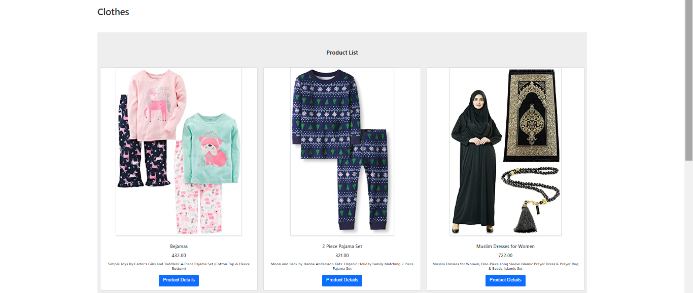
2- Mobiles
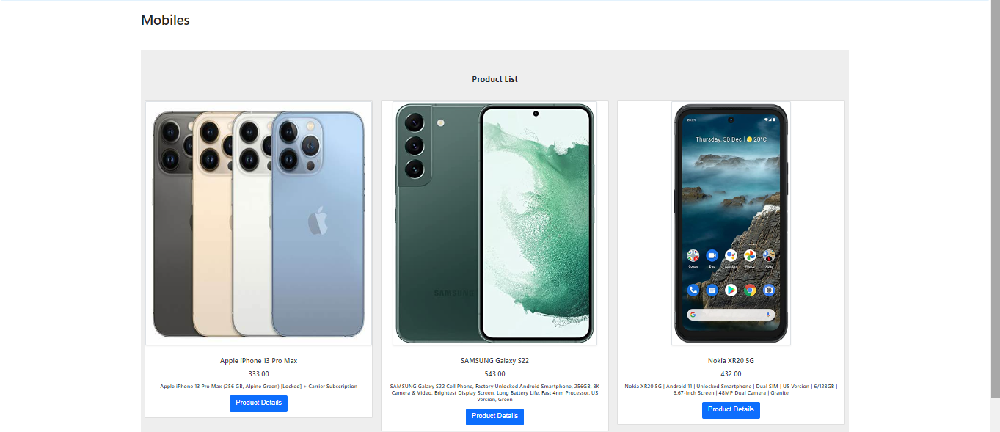
3- Computers
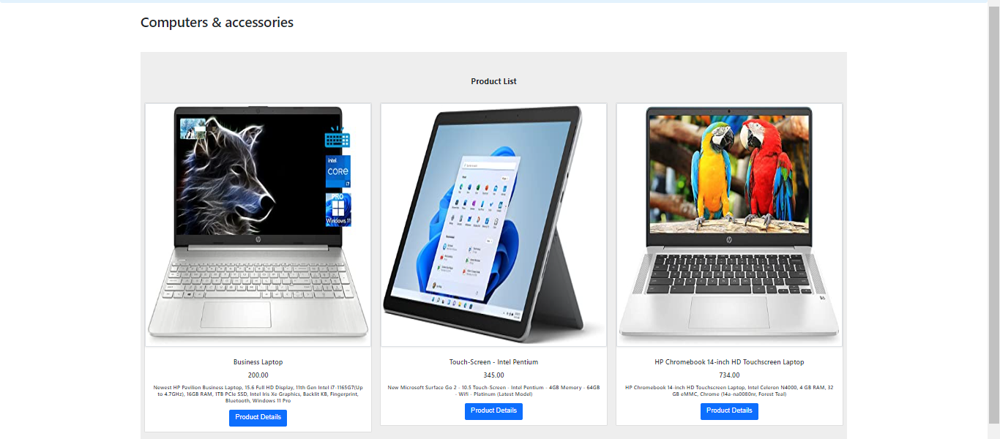
4- Furniture
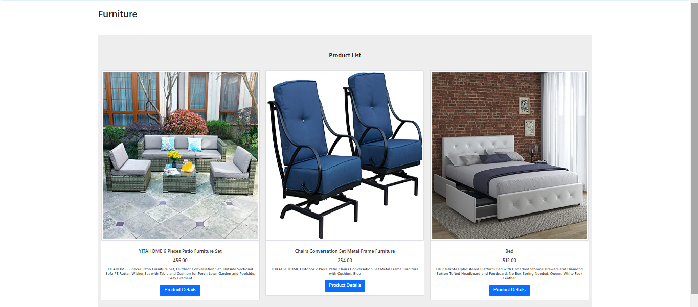
5- Beauty
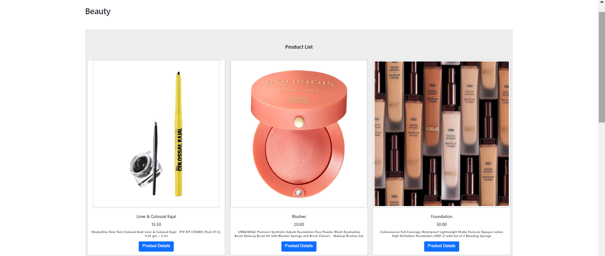

## Fast Market Features

#|Title|Features
---|------|-------
1|Category|(Ability to Add New Category)
2|Category|(Ability to list Categories)
3|Category|(Ability to Update Category)
4|Category|(Ability to Delete Category)
5|Product|(Ability to add new Products)
6|Product|(Ability to List Products)
7|Product|(Ability to update Products)
8|Product|(Ability to delete Products)
9|Product|(Ability to add Product to category)
10|Product|(Ability to delete Product from category)
11|Cart|(Create a Cart	)
12|Cart|(Ability to see the Cart and it items)
13|Cart|(Ability of add a new Product on the Cart)
14|Cart|(Ability of Remove a product from the Cart)
15|Cart|(An Email will be sent)
16|Order|(Ability of Create an order)
17|Order|(Ability of Remove an order)
18|Order|(Ability of Create multiple orders)

---

# Admin Dashboard
## Stories and Tasks
- As an admin user, I would like to have a dashboard where I can see a list of product categories  
- As an admin user, I would like to view a detail page for each category so that I can eventually edit its data or delete it  
- As an admin user, I would like to see a list of the products assigned to a category on the category details page  
- As an admin user, I would like a detail page for each product so that I can eventually edit its data or delete it  
- As an administrator I would like add and save a new category so that I can expand my product lines  
- As an administrator I would like add and save a new product so that I can expand my inventory  
- As an administrator I would like to associate a product to a category so that my users can more easily browse our inventory  
- As an administrator I would like to be able to delete products and categories as needed  
- As an administrator I would like to be able to edit/modify categories so that I can change my storefront structure in real time  
- As an administrator I would like to be able to edit/modify products so that I can change my inventory in real time    
- As the site owner, I would like to secure the admin dashboard so that only users with an administrative role can access it  
- As an administrator I would like to ensure that only users in the Administrator role can add categories or products  
- As an administrator I would like to ensure that only users in the Editor permissions can modify categories or products  
- As an administrator I would like to ensure that only users in the Editor permissions can add a product to a category  
- As an administrator I would like to ensure that only users in the Administrator permissions can delete categories or products  
- As an administrator I would like upload a picture for each product so that my shoppers will know what our products look like  
- As an administrator I would like replace a picture for each product so that I can keep my inventory up to date  
- As an administrator, I would like a preview of my product listings so that I can see what my customers will see in the online store   

# User Dashboard
## User Stories and Tasks
- As a user, I would like to see products available for sale so that I can browse through the inventory for purchase.
- As a user, I would like to register for an account on the site, so that I can make purchases
- As a user, I would like to securely login to my account so that I can add products to my shopping cart
- As a user, I would like a way to store the items I wish to purchase in a cart within the application.
- As a user, I would like the ability to view my desired purchases while browsing the other products on the site.
- As a user I would like a dedicated page where I can view all the products I wish to purpose all in one location.
- As a user, I would like to see a summary of my purchase after completing my checkout process.
- As a user, I would like a summary of my purchase to be emailed to me so that I can store the receipt for my records.
- As a user, I would like to be thanked for my purchase following completion of order processing
- As an administrator, I would like a copy of all purchases emailed to our sales department so that they can update our accounting system
- As an administrator, I would like a copy of all purchases emailed to our warehouse so that they can begin the fulfillment process

## ERD Diagram
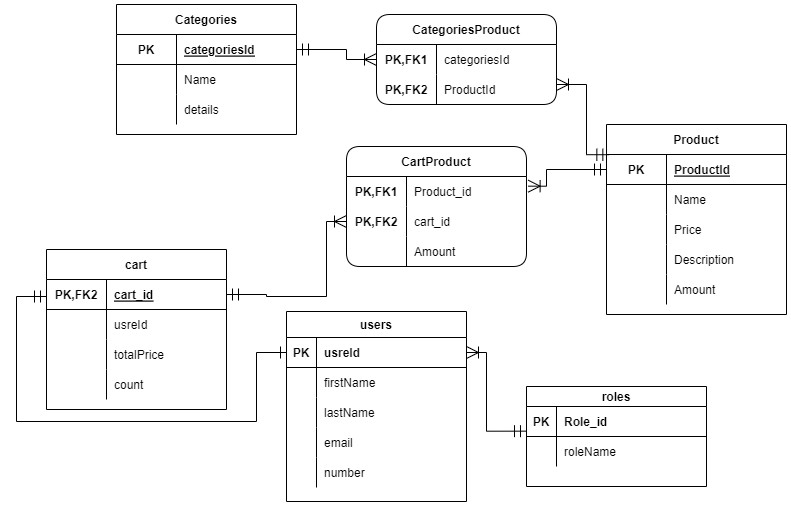

## Explanation of Tables:

- Category Table : contains Name and Details Properties.
- Product Table : contains Name, Price,Description and amountProperties.
- Cart Table : contains total prica and count.

## WireFrames

**Sign Up**

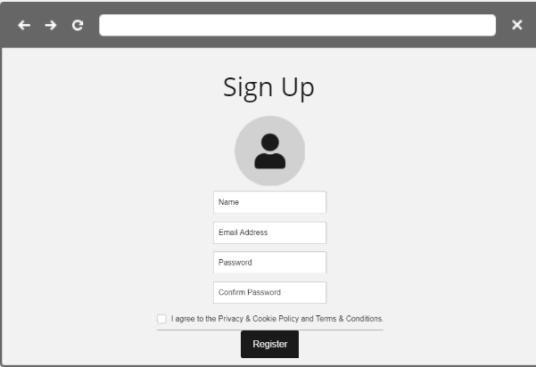

**Sign In**

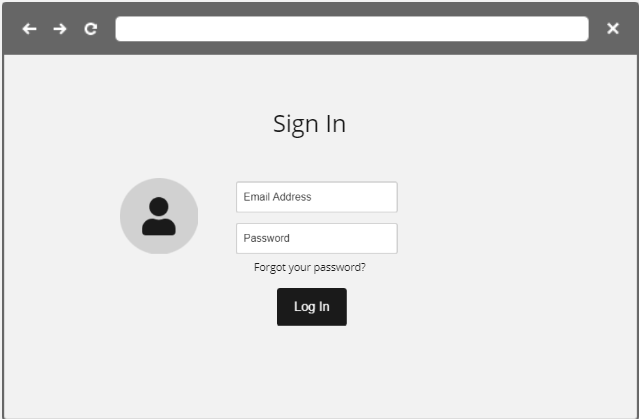

**Home Page**

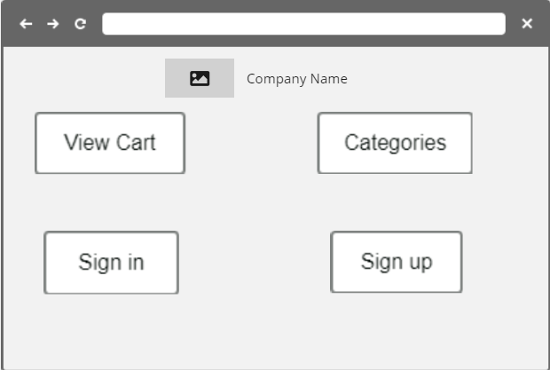  

**Category List**

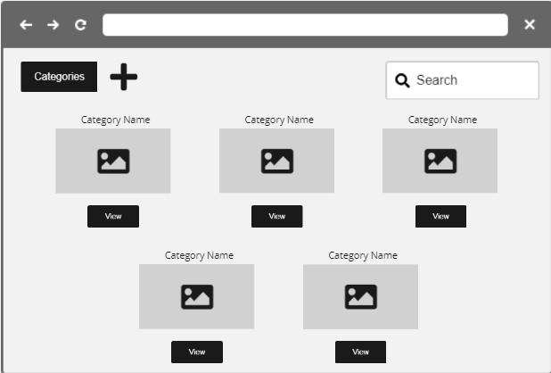 

**Category Details & List of Products**

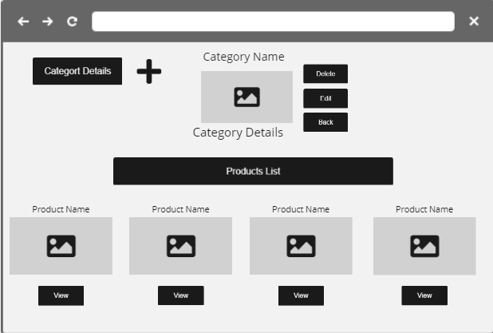   

**Product Details**

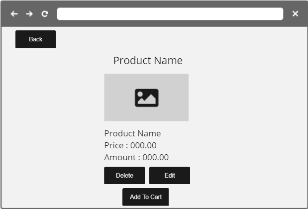  

**Add / Edit Category**

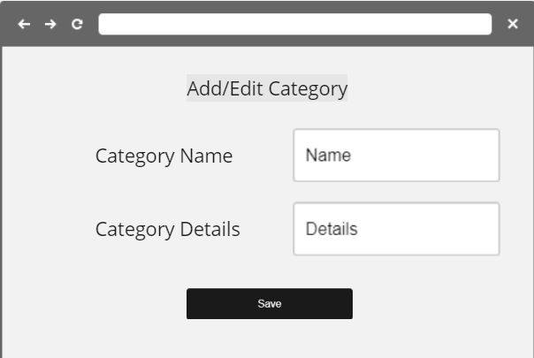  

**Add / Edit Product**

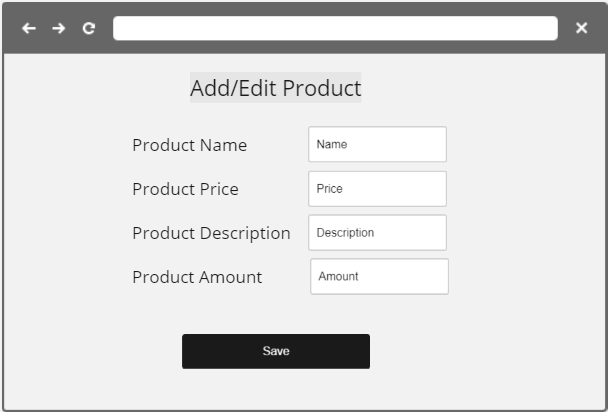  

**Cart Page**

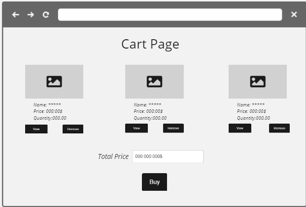   

## WorkFlow

User Stories:

1- As an admin user, I would like to have a dashboard where I can see a list of product categories  
2- As an admin user, I would like to view a detail page for each category so that I can eventually edit its data or delete it  
3- As an admin user, I would like to see a list of the products assigned to a category on the category details page  
4- As an admin user, I would like a detail page for each product so that I can eventually edit its data or delete it  

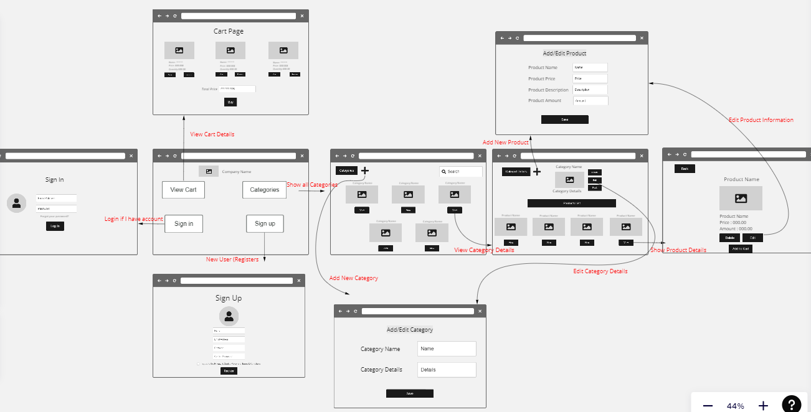
